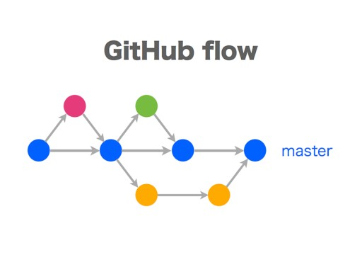

# Integrating with Version Control Systems (e.g., Git) in Emacs

### `Table of contents`

- [Integrating with Version Control Systems (e.g., Git) in Emacs](#integrating-with-version-control-systems-eg-git-in-emacs)
    - [`Table of contents`](#table-of-contents)
  - [Introduction](#introduction)
  - [Basic Git commands within Emacs](#basic-git-commands-within-emacs)
    - [1. **Initializing a Git Repository**](#1-initializing-a-git-repository)
    - [2. **Staging Changes**](#2-staging-changes)
    - [3. **Committing Changes**](#3-committing-changes)
    - [4. **Pushing Changes**](#4-pushing-changes)
    - [5. **Pulling Changes**](#5-pulling-changes)
  - [Viewing Diffs and Managing Branches](#viewing-diffs-and-managing-branches)
    - [1. **Viewing Diffs**](#1-viewing-diffs)
    - [2. **Managing Branches**](#2-managing-branches)
  - [Emacs and Version Control Workflows](#emacs-and-version-control-workflows)
    - [1. **Branching, Merging, and Resolving Conflicts**](#1-branching-merging-and-resolving-conflicts)
    - [2. **Committing and Pushing Changes**](#2-committing-and-pushing-changes)
  - [Conclusion](#conclusion)


## Introduction

Version control systems are crucial tools for managing code and collaborative development. Emacs, a powerful and extensible text editor, offers seamless integration with various version control systems, including Git. This article will explore how Emacs facilitates Git integration, covering basic Git commands, viewing diffs, managing branches, and incorporating Git into different workflows.

## Basic Git commands within Emacs

### 1. **Initializing a Git Repository**

Emacs provides a straightforward interface for creating a new Git repository. Users can utilize the `magit-init` command to initialize a new project and set up Git version control.

```shell 
magit-init /path/to/your/directory
```

### 2. **Staging Changes**

The `magit-stage` command allows users to select and stage specific files or changes before committing them to the repository. This ensures that only intended modifications are included in the next commit.

### 3. **Committing Changes**

Emacs streamlines the process of committing changes with the `magit-commit` command. This command opens a dedicated buffer for composing commit messages and allows users to provide detailed descriptions of their modifications.

### 4. **Pushing Changes**

With the `magit-push` command, users can effortlessly push their committed changes to a remote repository. Emacs also provides options for specifying the remote branch and setting additional parameters.

### 5. **Pulling Changes**

Emacs offers an intuitive interface for pulling the latest changes from a remote repository using the `magit-pull` command. This ensures that local code is always up-to-date with the latest developments.

---

## Viewing Diffs and Managing Branches

### 1. **Viewing Diffs**

Emacs excels at visualizing code changes. The `magit-diff` command provides a comprehensive view of modifications, highlighting additions, deletions, and modifications. Users can navigate through the changes with ease.

### 2. **Managing Branches**

Emacs offers a suite of commands for managing Git branches. Users can create new branches, switch between them, and merge branches effortlessly. The `magit-branch` command provides a comprehensive interface for performing these operations.

---

## Emacs and Version Control Workflows

### 1. **Branching, Merging, and Resolving Conflicts**

Emacs empowers users to efficiently handle branching and merging workflows. The `magit-branch` command facilitates the creation of new branches, while the merge interface allows for the seamless integration of changes from one branch into another. Additionally, Emacs provides powerful tools for resolving conflicts that may arise during the merging process.



### 2. **Committing and Pushing Changes**

Emacs enhances the commit and push workflow by providing a unified interface for composing commit messages and pushing changes to remote repositories. Users can review their changes, add detailed commit messages, and push modifications to the desired branch.

---

## Conclusion

Emacs offers a robust environment for integrating with Version Control Systems, particularly Git. Its extensive set of commands and intuitive interfaces streamline common Git operations. Whether you're staging changes, visualizing diffs, managing branches, or resolving conflicts, Emacs provides a seamless experience for version control. By incorporating Git into your Emacs workflow, you can enhance your productivity and streamline collaborative development efforts.